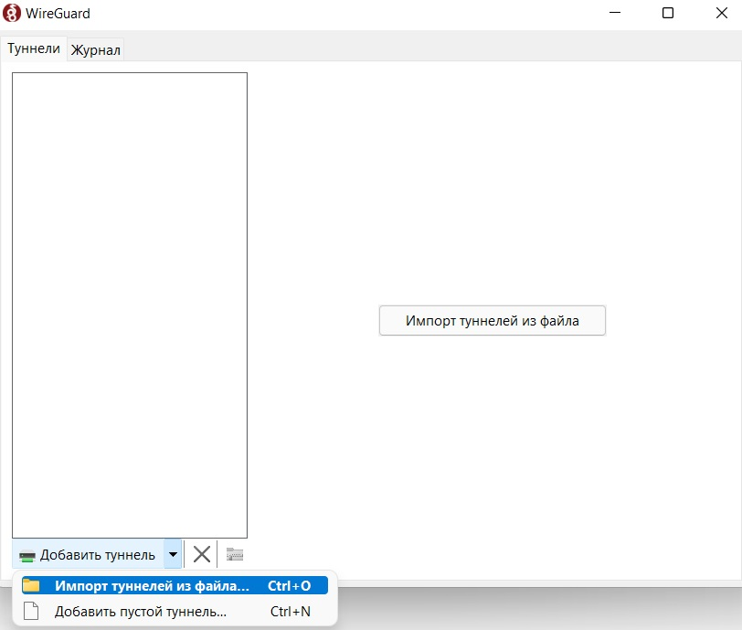

# Подключение WireGuard VPN из Windows

[WireGuard](https://www.wireguard.com)  - быстрый и совремменный VPN. 
* Удобство эксплуатации
* Высокая производительность
* Безопасность

Чтобы воспользоваться всеми достоинствами этого приложения необходимо:
1. Установить программу [WireGuard с официального сайта](https://www.wireguard.com/install/)

2. Запустить скаченный файл

3. В открывшемся окне приложения выбрать пункт "Импорт туннелей из файла" (можно использовать горячие клавиши Ctrl+O)

5. Для создания тунннеля выбрать файл с разрешением *.conf

7. Чтобы включить VPN, нажать кнопку "Подключить"

Поздравляю, теперь вы можете воспользоваться [калькулятором](сюда ссылку на калькулятор для проверки?)
